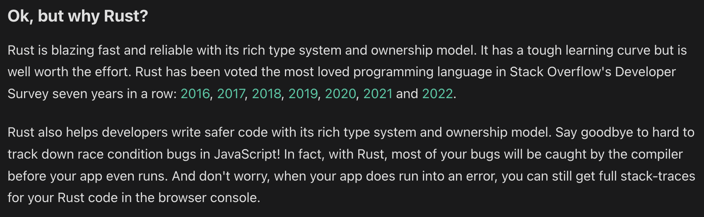

# Rust

Rust is just reliable. You know exactly what is going on and you know that it is going to work. Increasing code reliability is critical for any core product.

In this repo, you will find different examples of Rust being used in different frameworks

| Framework | Description |
| ----------- | ----------- |
| Yew | Very much like React. Frontend framework to build websites |
| Actix | Backend server framework. Easily handle [hundreds of thousands of connections](https://www.techempower.com/benchmarks/#section=data-r21&hw=ph&test=fortune) |
| Rocket | Backend server framework. Easier to get started with |

[Here's an example](https://medium.com/@dexthinks/comparison-between-java-go-and-rust-fdb21bd5fb7c) of the performance of Rust

## Examples of companies who use Rust

[Here's a repo](https://github.com/omarabid/rust-companies) that has some examples of companies that use Rust

| Company | Example |
| ---------- | ---------- |
| Meta | https://engineering.fb.com/2022/07/27/developer-tools/programming-languages-endorsed-for-server-side-use-at-meta/ |
| Figma | https://www.figma.com/blog/rust-in-production-at-figma/ |
| Discord | https://discord.com/blog/why-discord-is-switching-from-go-to-rust |
| Amazon | https://aws.amazon.com/blogs/opensource/why-aws-loves-rust-and-how-wed-like-to-help/ |